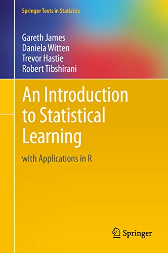
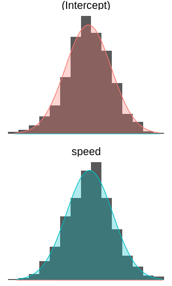
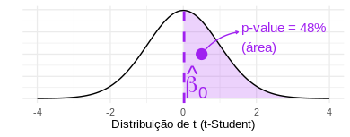
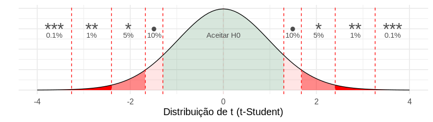

```{r setup, include=FALSE}
options(htmltools.dir.version = FALSE)
knitr::opts_chunk$set(echo = FALSE, dpi=300)
library(MASS)
library(plot3D)
library(lime)
library(broom)
library(ISLR)
library(caret)
library(patchwork) #devtools::install_github("thomasp85/patchwork")
library(tidyverse)
theme_set(theme_minimal(12))
```

## Referência


<br>
<center>
<a href = "https://www.ime.unicamp.br/~dias/Intoduction%20to%20Statistical%20Learning.pdf">
 
</a>
</center>


---

## O que é e quando usar


.pull-left[

### Regressão Linear Simples

$$
y = \beta_0 + \beta_1x
$$

### Exemplo: 

$$
dist = \beta_0 + \beta_1speed
$$


]


.pull-right[

```{r}
grafico_da_reta <- ggplot(cars) + 
  geom_point(aes(x = speed, y = dist), size = 5)  +
  theme_minimal(24)+
  labs(
    title = " "
  ) 

grafico_da_reta
```

]


.footnote[
Ver [ISL](https://www.ime.unicamp.br/~dias/Intoduction%20to%20Statistical%20Learning.pdf) página 61 (Simple Linear Regression).
]


---

## O que é e quando usar


.pull-left[

### Regressão Linear Simples

$$
y = \beta_0 + \beta_1x
$$

### Exemplo: 

$$
dist = \beta_0 + \beta_1speed
$$


]


.pull-right[

```{r}
grafico_da_reta_escolhida_a_mao <- grafico_da_reta + 
  geom_abline(
    intercept = 12, 
    slope = 3, 
    size = 3,
    colour = "royalblue"
  ) +
  labs(
    title = "Reta escolhida a mão (no olho!)"
  ) 

grafico_da_reta_escolhida_a_mao
```

]


.footnote[
Ver [ISL](https://www.ime.unicamp.br/~dias/Intoduction%20to%20Statistical%20Learning.pdf) página 61 (Simple Linear Regression).
]


---

## O que é e quando usar


.pull-left[

### Regressão Linear Simples

$$
y = \beta_0 + \beta_1x
$$

### Exemplo: 

$$
dist = \beta_0 + \beta_1speed
$$


]


.pull-right[

```{r}
# ajuste de uma regressão linear simples no R
melhor_reta <- lm(dist ~ speed, data = cars)

grafico_da_melhor_reta <- grafico_da_reta_escolhida_a_mao +
  geom_abline(
    intercept = melhor_reta$coefficients[1], 
    slope =     melhor_reta$coefficients[2], 
    size = 3,
    colour = "salmon"
  ) +
  labs(
    title = "Agora com a Melhor Reta."
  )+
  theme_minimal(24)

grafico_da_melhor_reta
```

]

.footnote[
Ver [ISL](https://www.ime.unicamp.br/~dias/Intoduction%20to%20Statistical%20Learning.pdf) página 61 (Simple Linear Regression).
]


---

## O que é e quando usar


.pull-left[

### Regressão Linear Simples

$$
y = \beta_0 + \beta_1x
$$

]


.pull-right[


]

```{r, echo = TRUE}
# ajuste de uma regressão linear simples no R
melhor_reta <- lm(dist ~ speed, data = cars) #<<
melhor_reta
```


.footnote[
Ver [ISL](https://www.ime.unicamp.br/~dias/Intoduction%20to%20Statistical%20Learning.pdf) página 61 (Simple Linear Regression).
]

---

## "Melhor Reta" segundo o quê?

Queremos a reta que **erre menos**.

Uma medida de erro: **E**rro **Q**uadrático **M**édio.

$$
EQM = \frac{1}{N}\sum(y_i - \hat{y_i})^2
$$

```{r, fig.width=10, fig.height=4, warning=FALSE}
cars_com_predicoes <- melhor_reta %>% 
  augment() %>%
  rename(pred_melhor_reta = .fitted) %>%
  mutate(
    pred_reta_a_mao = 12 + 3 * speed
  )

grafico_residuos_melhor_reta <- cars_com_predicoes %>%
  ggplot(aes(x = speed, y = dist)) +
  geom_point(size = 2) +
  geom_abline(
    intercept = melhor_reta$coefficients[1], 
    slope =     melhor_reta$coefficients[2], 
    size = 1,
    colour = "salmon"
  ) +
  geom_segment(aes(xend = speed, yend = pred_melhor_reta), colour = "blue", size = 1) +
  labs(
    subtitle = "Resíduos da Melhor Reta",
    title = "Os segmentos azuis quantificam o quanto o modelo errou naqueles pontos."
  ) +
  annotate("text", x = 5, y = 110, label = expression(y==-17.579 + 3.932 ~ "speed"), parse = TRUE, hjust = 0, size = 6)

grafico_residuos_reta_a_mao <- cars_com_predicoes %>%
  ggplot(aes(x = speed, y = dist)) +
  geom_point(size = 2) +
  geom_abline(
    intercept = 12, 
    slope =     3, 
    size = 1,
    colour = "orange"
  ) +
  geom_segment(aes(xend = speed, yend = pred_reta_a_mao), colour = "blue", size = 1) +
  labs(
    subtitle = "Resíduos da Reta Escolhida a Mão"
  ) +
  annotate("text", x = 5, y = 110, label = expression(y==12 + 3 ~ "speed"), parse = TRUE, hjust = 0, size = 6)

grafico_residuos_melhor_reta + grafico_residuos_reta_a_mao
```


---

## "Melhor Reta" segundo o quê?

Queremos a reta que **erre menos**.

Uma medida de erro: **E**rro **Q**uadrático **M**édio.

$$
EQM = \frac{1}{N}\sum(y_i - \hat{y_i})^2
$$

Ou seja, nosso **objetivo** é

## Encontrar $\hat{\beta}_0$ e $\hat{\beta}_1$ que nos retorne o ~menor~ EQM.

--

... que é o mesmo que dizer "encontrar a melhor reta que explique os dados".

OBS: o EQM é a nossa **Função de Custo**.

---

## Qual o valor ótimo para $\beta_0$ e $\beta_1$?

No nosso exemplo, a nossa **HIPÓTESE** é de que 

$$
dist = \beta_0 + \beta_1speed
$$

Então podemos escrever o Erro Quadrático Médio como

$$
EQM = \frac{1}{N}\sum(y_i - \hat{y_i})^2 = \frac{1}{N}\sum(y_i -  \color{red}{(\hat{\beta}_0 + \hat{\beta}_1speed)})^2 
$$

Com ajuda do Cálculo é possível mostrar que os valores ótimos para $\beta_0$ e $\beta_1$ são

$\hat{\beta}_1 = \frac{\sum(x_i - \bar{x})(y_i - \bar{y})}{\sum(x_i - \bar{x})^2}$

$\hat{\beta}_0 = \bar{y} - \hat{\beta}_1\bar{x}$

Já que vieram do EQM, eles são chamados de **Estimadores de Mínimos Quadrados**.

```{r, echo=TRUE}
# lembrete: exercício 2 do script!
```


---

## Depois de estimar...

$$
\hat{y} = \hat{\beta}_0 + \hat{\beta}_1x
$$

### Exemplo:

$$
\hat{dist} = \hat{\beta}_0 + \hat{\beta}_1speed
$$

Colocamos um $\hat{}$ em cima dos termos para representar "estimativas". Ou seja, $\hat{y}_i$ é uma estimativa de $y_i$.

No nosso exemplo, 

- $\hat{\beta}_0$ é uma estimativa de $\beta_0$ e vale `-17.579`.
- $\hat{\beta}_1$ é uma estimativa de $\beta_1$ e vale `3.932`.
- $\hat{dist}$ é uma estimativa de $dist$ e vale `-17.579 + 3.932 x speed`.

```{r, echo=TRUE}
# Exercício: se speed for 15 m/h, quanto que 
# seria a distância dist esperada?
```

---

## Teste de Hipóteses e valor-p

Exemplo: relação entre População Urbana e Assassinatos.

.pull-left[

```{r, fig.width=6, fig.height=4, warning=FALSE}
data("USArrests")
ggplot(USArrests, aes(x = UrbanPop, y = Murder)) +
  geom_point(size = 3) +
  coord_cartesian(xlim = c(35, 90)) +
  geom_smooth(aes(colour = "Modelo"), method = "lm", size = 2) +
  geom_abline(mapping = aes(colour = "Hipótese", intercept = mean(USArrests$Murder), slope = 0), size = 2, linetype = "dashed") +
  labs(x = "População Urbana (em %)", y = "Assassinatos (por 100 mil habitantes)") +
  # theme_minimal(18) +
  theme(legend.position = "top")
```

Modelo proposto: 

$$y = \beta_0 + \beta_1 x$$

]

.pull-right[

Hipótese do pesquisador: 
> "Assassinatos não estão relacionados com a proporção de população urbana de uma cidade."

Tradução da hipótese em termos matemáticos:

$$
H_0: \beta_1 = 0 \space\space\space\space\space vs \space\space\space\space H_a: \beta_1 \neq 0
$$
Se a hipótese for verdade, então o $\beta_1$ deveria ser zero. Porém, os dados disseram que $\hat{\beta}_1 = 0.02$. 

### 0.02 é diferente de 0.00? 

]


---

## 0.02 é diferente de 0.00? 

### Saída do R

```{r, highlight.output=c(12)}
lm(Murder ~ UrbanPop, data = USArrests) %>% summary()
```


---

## 0.02 é diferente de 0.00? 

Conceito importante: Os estimadores ( $\hat{\beta}_0$ e $\hat{\beta}_1$ no nosso caso) têm distribuições de probabilidade.

### Simulação de 1000 retas (ajustadas com dados diferentes).


---

## 0.02 é diferente de 0.00? 

Conceito importante: Os estimadores ( $\hat{\beta}_0$ e $\hat{\beta}_1$ no nosso caso) têm distribuições de probabilidade.

### A Teoria Assintótica nos fornece o seguinte resultado:


.pull-left[

$t = \frac{\hat{\beta_1} - \beta_1}{\hat{\sigma}_{\beta_1}} \overset{\text{a}}{\sim}  t(N - 2)$

#### Em que

$\hat{\sigma}_{\beta_1} = \sqrt{\frac{EQM}{\sum(x_i - \bar{x})^2}}$


Usamos essas distribuições assintóticas para testar as hipóteses.

]

.pull-right[

<div style="width:200px; height:100px">

</div>

]


---


## 0.02 é diferente de 0.00? 

Conceito importante: Os estimadores ( $\hat{\beta}_0$ e $\hat{\beta}_1$ no nosso caso) têm distribuições de probabilidade.

### A Teoria Assintótica nos fornece o seguinte resultado:


.pull-left[


$t = \frac{\hat{\beta_1} - \beta_1}{\hat{\sigma}_{\beta_1}} \overset{\text{a}}{\sim}  t(N - 2)$

#### Em que

$\hat{\sigma}_{\beta_1} = \sqrt{\frac{EQM}{\sum(x_i - \bar{x})^2}}$

Usamos essas distribuições assintóticas para testar as hipóteses.

]

.pull-right[

No nosso exemplo, a hipótese é $H_0: \beta_1 = 0$, então 

$$t = \frac{0.02 - 0}{0.04} = 0.48$$



]


---

## 0.02 é diferente de 0.00? 

Então agora podemos tomar decisão! Se a estimativa cair muito distante da distribuição t da hipótese 0, decidimos por **rejeitá-la**. Caso contrário, decidimos por **aceitá-la** como verdade.



```{r}
cat("NO R:
Coefficients:
            Estimate Std. Error t value Pr(>|t|)  
(Intercept)  6.41594    2.90669   2.207   0.0321 *
UrbanPop     0.02093    0.04333   0.483   0.6312  
---
Signif. codes:  0 '***' 0.001 '**' 0.01 '*' 0.05 '.' 0.1 ' ' 1")
```

---

## Interpretação dos parâmetros

.pull-left[

```{r}
grafico_cars <- ggplot(cars, aes(x = speed, y = dist)) + 
  geom_point(size = 5, alpha = 0.1) + 
  geom_abline(
    intercept = melhor_reta$coefficients[1], 
    slope =     melhor_reta$coefficients[2], 
    size = 2,
    colour = "salmon"
  ) 

grafico_cars+
  coord_cartesian(xlim = c(-4, 26), ylim = c(-25, 126)) +
  annotate("segment", 
           y = melhor_reta$coefficients[1] + melhor_reta$coefficients[2] * 15,
           yend = melhor_reta$coefficients[1] + melhor_reta$coefficients[2] * 15,
           x = 15,
           xend = 19,
           size = 2,
           colour = "darkgreen") +
  annotate("segment", 
           y = melhor_reta$coefficients[1] + melhor_reta$coefficients[2] * 15,
           yend = melhor_reta$coefficients[1] + melhor_reta$coefficients[2] * 19,
           x = 19,
           xend = 19,
           size = 2,
           colour = "darkgreen") +
  annotate("segment", 
           y = melhor_reta$coefficients[1],
           yend = 0,
           x = 0,
           xend = 0,
           size = 2,
           colour = "darkblue") +
  geom_vline(xintercept = 0, colour = "grey20") +
  geom_hline(yintercept = 0, colour = "grey20") +
  theme_minimal(24)
```

$$
y = \color{darkgblue}{\beta_0} + \color{darkgreen}{\beta_1}x
$$

]

.pull-right[

### Interpretações matemáticas

$\color{darkgblue}{\beta_0}$ é o lugar em que a reta cruza o eixo Y.

$\color{darkgreen}{\beta_1}$ é a derivada de Y em relação ao X. É quanto Y varia quando X varia em 1 unidade.

### Interpretações estatísticas

$\color{darkgblue}{\beta_0}$ é a distância percorrida esperada quando o carro está parado (X = 0).

$\color{darkgreen}{\beta_1}$ é o efeito médio na distância por variar 1 ml/h na velocidade do carro.


]


---

## Teste de Hipóteses e valor-p 

### Exercício 3 do script: 

No R, use a função `summary(melhor_reta)` (ver slide 5) para decidir se `speed` está associado com `dist`. Descubra o valor-p associado.

lembrete: o banco de dados se chama `cars`.

### Exercício 4 do script: 

Interprete o parâmetro $\beta_1$.

---

## O modelo está bom?

### EQM e EPR

ERP significa *E*rro *P*adrão dos *R*esíduos e é definido como 

$$
EPR = \frac{\sum(y_i - \hat{y_i})^2}{N - 2} = \frac{SQR}{N - 2}
$$
O **2** no denominador decorre do fato de termos **2 parâmetros** para estimar no modelo.

- Se $y_i = \hat{y}_i \space\space\space \rightarrow \color{green}{EPR = 0 \downarrow}$
- Se $y_i >> \hat{y}_i \rightarrow \color{red}{EPR = alto \uparrow}$
- Se $y_i << \hat{y}_i \rightarrow \color{red}{EPR = alto \uparrow}$


Problema: Como sabemos se o EPR é grande ou pequeno?

.footnote[
Ver [ISL](https://www.ime.unicamp.br/~dias/Intoduction%20to%20Statistical%20Learning.pdf) página 68 (Assessing the Accuracy of the Model).

]


---

## O modelo está bom?

### R-quadrado ( $R^2$ )

$$
R^2 = 1 - \frac{\sum(y_i - \color{salmon}{\hat{y_i}})^2}{\sum(y_i - \color{royalblue}{\bar{y}})^2} = 1 - \frac{\color{salmon}{SQR}}{\color{royalblue}{SQT}}
$$

.pull-left[

```{r, fig.align="center", fig.asp=0.5, warning=FALSE}
grafico_cars +
  geom_smooth(method = "lm", formula = y ~ 1, se = FALSE, size = 2) +
  annotate("text", label = expression(bar(y)), y = mean(cars$dist), x = 5, vjust = -0.6, hjust = 2, size = 9, colour = "royalblue")
```

]

.pull-right[

$R^2 \approx 1 \rightarrow \color{salmon}{SQR} << \color{royalblue}{SQT}$.
$R^2 \approx 0 \rightarrow \color{salmon}{reta} \text{ em cima da } \color{royalblue}{reta}$.

Problema do $R^2$ é que ele sempre aumenta conforme novos preditores vão sendo incluídos.

]


.footnote[
Ver [ISL](https://www.ime.unicamp.br/~dias/Intoduction%20to%20Statistical%20Learning.pdf) página 68 (Assessing the Accuracy of the Model).
]

---

## O modelo está bom?

### R-quadrado ajustado

$$
R^2 = 1 - \frac{\color{salmon}{SQR}}{\color{royalblue}{SQT}}\frac{\color{royalblue}{N-1}}{\color{salmon}{N-p}}
$$

Em que $p$ é o número de parâmetros do modelo (no caso da regressão linear simples, $p = 2$).

```{r, echo=TRUE}
# lembrete: exercícios 5 e 6 do script!
```

---

## Outliers

```{r, fig.align="center", fig.height=4, fig.width=9}
cars_com_predicoes_outliers <- cars_com_predicoes %>%
  mutate(outlier = 13 == 1:nrow(.),
         .resid = ifelse(outlier, 130, .resid)) 

cars_com_predicoes_outliers %>%
  ggplot(aes(x = speed, y = .resid)) +
  coord_cartesian(ylim = c(-50, 135)) +
  geom_point(size = 6, colour = "red", data = cars_com_predicoes_outliers %>% filter(outlier), alpha = 0.6) +
  labs(x = "Valores preditos", y = "Resíduos")+
  geom_point(size = 2) +
  theme_minimal(18)
```

Resíduo = $y_i - \hat{y}_i$ (observado - esperado).

```{r, echo = TRUE}
# lembrete: faça o exercício 7 do script
```

.footnote[
Ver [ISL](https://www.ime.unicamp.br/~dias/Intoduction%20to%20Statistical%20Learning.pdf) página 96 (Outliers).
]

---

## Regressão Linear Múltipla

### Regressão Linear Simples

$$
y = \beta_0 + \beta_1x
$$

### Regressão Linear Múltipla

$$
y = \beta_0 + \beta_1x_1 + \beta_2x_2 + \dots + \beta_px_p
$$

```{r, echo = TRUE, eval = FALSE}
# ajuste de uma regressão linear múltipla no R
modelo_boston <- lm(medv ~ lstat + age, data = Boston) #<<
summary(modelo_boston)
#             Estimate Std.Error t value Pr(>|t|)    
# (Intercept) 33.22    0.73      45.4    < 2e-16 ***
# lstat       -1.03    0.04     -21.4    < 2e-16 ***
# age          0.03    0.01       2.8    0.00491 ** 
```

.footnote[
Ver [ISL](https://www.ime.unicamp.br/~dias/Intoduction%20to%20Statistical%20Learning.pdf) página 71 (Multiple Linear Regression).
]


---

## Regressão Linear Múltipla

### Exemplo: Plano em vez de reta

Modelo: `lm(mpg ~ disp + wt, data = mtcars)`

```{r, fig.height=4, fig.align="center", fig.width=7}
# x, y, z variables
x <- mtcars$wt
y <- mtcars$disp
z <- mtcars$mpg
# Compute the linear regression (z = ax + by + d)
fit <- lm(z ~ x + y)
# predict values on regular xy grid
grid.lines = 26
x.pred <- seq(min(x), max(x), length.out = grid.lines)
y.pred <- seq(min(y), max(y), length.out = grid.lines)
xy <- expand.grid( x = x.pred, y = y.pred)
z.pred <- matrix(predict(fit, newdata = xy), 
                 nrow = grid.lines, ncol = grid.lines)
# fitted points for droplines to surface
fitpoints <- predict(fit)
# scatter plot with regression plane
scatter3D(x, y, z, pch = 18, cex = 2, 
    theta = 20, phi = 20, ticktype = "detailed",
    xlab = "wt", ylab = "disp", zlab = "mpg",  
    surf = list(x = x.pred, y = y.pred, z = z.pred,  
    facets = NA, fit = fitpoints))
```

.footnote[
Fonte: [sthda.com/impressive-package-for-3d](http://www.sthda.com/english/wiki/impressive-package-for-3d-and-4d-graph-r-software-and-data-visualization)
]

---

## Preditores Categóricos

### Preditor com apenas 2 categorias

Saldo médio no cartão de crédito é diferente entre homens e mulheres?

```{r, fig.height=1.5}
Credit %>%
  ggplot(aes(x = Gender, y = Balance, fill = Gender)) +
  geom_boxplot(show.legend = FALSE) +
  coord_flip() +
  labs(y = "Saldo médio no cartão de crédito (USD)", x = "")
```

```{r, echo = TRUE, eval = FALSE}
summary(lm(Balance ~ Gender, data = Credit))
# Coefficients:
#              Estimate  Std.Error  t value Pr(>|t|)    
# (Intercept)    509.80  33.13      15.389   <2e-16 ***
# GenderFemale    19.73  46.05       0.429    0.669   
```


.footnote[
Ver [ISL](https://www.ime.unicamp.br/~dias/Intoduction%20to%20Statistical%20Learning.pdf) página 84 (Predictors with Only Two Levels).
]


---

## Preditores Categóricos

### Preditor com apenas 2 categorias

Saldo médio no cartão de crédito é diferente entre homens e mulheres?

```{r, fig.height=1.5}
Credit %>%
  ggplot(aes(x = Gender, y = Balance, fill = Gender)) +
  geom_boxplot(show.legend = FALSE) +
  coord_flip() +
  labs(y = "Saldo médio no cartão de crédito (USD)", x = "")
```


$$
y_i = \beta_0 + \beta_1x_i \space\space\space\space\space\space \text{em que}\space\space\space\space\space\space x_i = \Bigg\\{\begin{array}{ll}1&\text{se a i-ésima pessoa for }\texttt{female}\\\\
0&\text{se a i-ésima pessoa for } \texttt{male}\end{array}
$$

```{r, echo = TRUE}
# lembrete: exercícios 8 e 9 do script!
```


.footnote[
Ver [ISL](https://www.ime.unicamp.br/~dias/Intoduction%20to%20Statistical%20Learning.pdf) página 84 (Predictors with Only Two Levels).
]


---

## Preditores Categóricos

### Preditor com 3 ou mais categorias

.pull-left[

```{r, fig.height=4}
Credit %>%
  ggplot(aes(x = Ethnicity, y = Balance, fill = Ethnicity)) +
  geom_boxplot(show.legend = FALSE) +
  coord_flip() +
  labs(y = "Saldo (USD)", x = "") +
  theme_minimal(22)
```


```{r, echo=TRUE, eval=FALSE}
summary(lm(Balance ~ Ethnicity, data = Credit))
#                    Estimate  Std.Error t value Pr(>|t|)    
# (Intercept)          531.00  46.32     11.464   <2e-16 ***
# EthnicityAsian       -18.69  65.02     -0.287    0.774    
# EthnicityCaucasian   -12.50  56.68     -0.221    0.826  
```


]

.pull-right[

Modelo

$$y_i = \beta_0 + \beta_1x_{1i} + \beta_2x_{2i}$$

Em que


$x_{1i} = \Bigg \{ \begin{array}{ll} 1 & \text{se for }\texttt{Asian}\\0&\text{caso contrário}\end{array}$
      
$x_{2i} = \Bigg \{ \begin{array}{ll} 1 & \text{se for }\texttt{Caucasian}\\0&\text{caso contrário}\end{array}$

]


---

## Preditores Categóricos

### Preditor com 3 ou mais categorias

"One hot enconding" ou "Dummies" ou "Indicadores".

```{r}
Credit %>% slice(1:8) %>% select(Ethnicity) %>%
  cbind(model.matrix(~Ethnicity, data = .)) %>%
  knitr::kable(format = "html")
```

```{r, echo = TRUE}
# lembrete: exercício 10 do script!
```

---

## Preditores Categóricos

### Preditor com 3 ou mais categorias

Interpretação dos parâmetros:

$y_{i} = \left\{ \begin{array}{ll} \beta_0 & \text{se for }\texttt{Afro American}\\ \beta_0 + \beta_1&\text{se for } \texttt{Asian}\\ \beta_0 + \beta_2&\text{se for } \texttt{Caucasian}\end{array}\right.$

```{r, echo = TRUE}
# interprete cada um dos três parâmetros individualmente.
# lembrete: exercícios 10 e 11 do script!
```


---

## Transformações Não Lineares dos Preditores

### Exemplo: log

.pull-left[
Modelo real: $y = 10 + 0.5log(x)$ 
]

.pull-right[
Modelo proposto: $\small y = \beta_0 + \beta_1log(x)$ 
]
```{r}
set.seed(1)
y_x <- tibble(
  x = runif(60),
  y = 10 + 0.5*log(x) + rnorm(30, sd = 0.1)
) 

grafico_y_x <- y_x %>%
  ggplot(aes(x = x, y = y)) + 
  geom_point( size = 3) 
  
  
grafico_y_x_curvas <- grafico_y_x +
  geom_smooth(aes(colour = "y ~ x"), method = "lm", se = FALSE, formula = y ~ x) +
  geom_smooth(aes(colour = "y ~ log(x)"), method = "lm", se = FALSE, formula = y ~ log(x)) +
  labs(colour = "Modelo") +
  theme(legend.position = "left") 

grafico_y_x_log <- grafico_y_x + scale_x_log10() + labs(x = "x (escala logarítmica)")
```

```{r, fig.width=9, fig.height=3, fig.align="center"}
grafico_y_x_curvas + grafico_y_x_log
```

Outras transformações comuns: raíz quadrada, polinômios, Box-Cox, ...

```{r, echo = TRUE}
# lembrete: exercício 12 do script!
```


---

## Transformações Não Lineares dos Preditores

### Exemplo: Regressão Polinomial

.pull-left[
Modelo real: $y = 500 + 0.4(x-10)^3$ 
]

.pull-right[
Modelo proposto: $y = \beta_0 + \beta_1x + \beta_2x^2 + \beta_3x^3$ 
]


```{r, fig.height=4, fig.width=11}
set.seed(1)
y_x_poly <- tibble(
  x = runif(30, 0, 20),
  y = 500 + 0.4 * (x-10)^3 + rnorm(30, sd = 50)
)


grafico_y_x_poly <- y_x_poly %>%
  ggplot(aes(x = x, y = y)) + 
  geom_point( size = 3) 


grafico_y_x_poly_curvas <- grafico_y_x_poly +
  geom_smooth(aes(colour = "y ~ x"), method = "lm", se = FALSE, formula = y ~ x) +
  geom_smooth(aes(colour = "y ~ poly(x, 2)"), method = "lm", se = FALSE, formula = y ~ poly(x, 2)) +
  geom_smooth(aes(colour = "y ~ poly(x, 3)"), method = "lm", se = FALSE, formula = y ~ poly(x, 3)) +
  labs(colour = "Modelo") 
grafico_y_x_poly + grafico_y_x_poly_curvas
```

```{r, echo = TRUE}
# lembrete: exercício 13 do script!
```

---

## Interações

Modelo proposto (Matemático): Seja `Sepal.Width` o $y$ e `Sepal.Length` o $x$,

$$\small \begin{array}{l} y = \beta_0 + \beta_1x + \beta_2I_{versicolor} + \beta_3I_{virginica} + \beta_4\color{red}{xI_{versicolor}} + \beta_5\color{red}{xI_{virginica}}\end{array}$$


```{r, out.height=180, out.height=260, fig.height=2, fig.width=4, fig.align="center"}
iris %>%
  ggplot(aes(x = Sepal.Length, y = Sepal.Width)) +
  geom_point(aes(colour = Species)) +
  geom_smooth(method = "lm", se = FALSE, colour = "black") +
  geom_smooth(method = "lm", aes(colour = Species), se = FALSE) +
  theme_minimal(10)
```


Modelo proposto (em R): `Sepal.Width ~ Sepal.Length * Species`

```{r, echo = TRUE}
# lembrete: exercícios 14 ao 17 do script!
```


---

## Multicolinearidade

.pull-left[

```{r, message = FALSE, warning=FALSE, fig.width=4, fig.height=4}
Credit %>%
  select(Balance, Age, Limit, Rating) %>%
  GGally::ggpairs() +
  theme_minimal(14)
```

]

.pull-right[

Modelo 1: sem colineares

```{r}
modelo_multicolinearidade1 <- lm(Balance ~ Limit + Age, data = Credit)
modelo_multicolinearidade2 <- lm(Balance ~ Limit + Rating, data = Credit)

tidy(modelo_multicolinearidade1) %>%
  mutate_if(is.numeric, round, digits = 2) %>%
  mutate(
    std.error = kableExtra::cell_spec(std.error, "html", background_as_tile = FALSE, color = ifelse(term == "Limit", "white", "black"), background = ifelse(term == "Limit", "darkred", "white"), align = "r")
  ) %>%
  knitr::kable(format = "html", escape = FALSE) %>%
  kableExtra::collapse_rows(columns = 1, valign = "middle") %>%
  kableExtra::kable_styling(font_size = 13)
```

Modelo 2: com colineares

```{r}
  tidy(modelo_multicolinearidade2) %>%
  mutate_if(is.numeric, round, digits = 2) %>%
  mutate(
    std.error = kableExtra::cell_spec(std.error, "html", background_as_tile = FALSE, color = ifelse(term == "Limit", "white", "black"), background = ifelse(term == "Limit", "darkred", "white"), align = "r")
  )  %>%
  knitr::kable(format = "html", escape = FALSE) %>%
  kableExtra::collapse_rows(columns = 1, valign = "middle") %>%
  kableExtra::kable_styling(font_size = 13)
```

]

Problema: Instabilidade numérica, desvios padrão inflados e interpretação comprometida.

Soluções: eliminar uma das variáveis muito correlacionadas ou Consultar o VIF (Variance Inflation Factor)

---

## Multicolinearidade

### VIF (Variance Inflation Factor)

Detecta preditores que são combinações lineares de outros preditores.


**Procedimento:** Para cada preditor $X_j$,

1) Ajusta regressão linear com as demais: `lm(X_j ~ X_1 + ... + X_p)`.

2) Calcula-se o R-quadrado dessa regressão e aplica a fórmula abaixo

$$\small VIF(\hat{\beta}_j) = \frac{1}{1 - R^2_{X_j|X_{-j}}}$$

3) Remova o preditor se VIF maior que 5 (regra de bolso).

```{r, echo = TRUE}
# lembrete: exercícios 18 do script!
```


.footnote[
Ver [ISL](https://www.ime.unicamp.br/~dias/Intoduction%20to%20Statistical%20Learning.pdf) página 101.
]


---

## Fazendo Predições

### Modelo

```{r, echo = TRUE}
modelo_iris <- lm(Sepal.Width ~ Sepal.Length * Species, data = iris)
```

Suponha que dados novos chegaram:

```{r, echo = TRUE}
dados_novos <- tibble(Sepal.Length = 10, Species = "setosa")
```


### Utilizando a função `augment()` do pacote `broom`

```{r, echo = TRUE, eval=FALSE}
augment(modelo_iris, newdata = dados_novos)
##   Sepal.Length Species .fitted .se.fit
## 1           10 setosa     7.42   0.553
```

O valor estimado de `Sepal.Width` foi de `7.42` +/- `0.55`.


---

## Fazendo Predições

### Modelo

```{r, echo = TRUE}
modelo_iris <- lm(Sepal.Width ~ Sepal.Length * Species, data = iris)
```

Suponha que dados novos chegaram:

```{r, echo = TRUE}
dados_novos <- data.frame(Sepal.Length = 10, Species = "setosa")
```


### Utilizando a função `predict()`

```{r, echo = TRUE, eval=FALSE}
dados_novos %>% 
  mutate(S.W.Est = predict(modelo_iris, newdata = dados_novos))
##  Sepal.Length Species S.W.Est
##            10 setosa     7.42
```


---

## Interpretabilidade da Predição

### LIME: Local Interpretable Model-agnostic Explanations

```{r, message=FALSE, warning=FALSE, include=FALSE}
dados_novos <- iris[1, c("Sepal.Width", "Sepal.Length", "Species")]
dados_novos$Sepal.Length <- 10
iris <- iris[, c("Sepal.Width", "Sepal.Length", "Species")]
modelo_iris <- train(Sepal.Width ~ Sepal.Length * Species, data = iris, type = "lm", tuneLength = 1 )
explicador <- lime(iris, modelo_iris)
explicacoes <- lime::explain(dados_novos, explicador, n_features = 2)
```


```{r, echo = TRUE, fig.align="center", message=FALSE, warning=FALSE, error=FALSE, eval=FALSE}
# fazendo lm com caret::train() pq o lime soh aceita caret
modelo_iris <- train(Sepal.Width ~ Sepal.Length * Species, data = iris, method = "lm")
explicador <- lime(iris, modelo_iris)
explicacoes <- lime::explain(dados_novos, explicador, n_features = 2)
plot_features(explicacoes) 
```

.pull-left[

```{r, echo = TRUE}
# lembrete: exercícios 19 
# do script!
```

]

.pull-right[

```{r, fig.height=2.5, fig.width=4}
plot_features(explicacoes) + theme(legend.position = "right")
```

]


.footnote[
Ver [LIME for R](https://github.com/thomasp85/lime) página 101.
]


---

## (Opcional) Abordagem Probabilística

Do ponto de vista probabilístico, modela-se o problema como uma amostra de N indivíduos, todos independentes entre si e com distribuição Normal.

$$
Y_i|x_i \sim N(\mu_i, \sigma^2), \space i = 1, \dots, N
$$

E então, supõem que a média de $Y$ dado o valor de $x$ seja linear:

$$
\mu = E[Y|x] = \beta_0 + \beta_1x
$$

Assim, gostaríamos de achar $\beta_0$ e $\beta_1$ que fizessem dessa amostra a mais verossímil possível. 

Daí entra o conceito de verossimilhança, que é a probabilidade conjunta dos dados acontecerem:

$$
P(Y_1, \dots, Y_N|x) \overset{\text{indep}}{=} P(Y_1|x_1)P(Y_2|x_2)\dots P(Y_N|x_N)
$$

continua...


---

## (Opcional) Abordagem Probabilística

Se tirarmos o $logarítmo$ dessa probabilidade conjunta, teremos:

$$
logP(Y_1, \dots, Y_N|x) \overset{\text{indep}}{=} logP(Y_i|x_1) + log P(Y_2|x_2) +\dots +logP(Y_N|x_N)
$$

Que podemos escrever de forma mais sussinta usando um somatório:

$$
\ell = logP(Y_1, \dots, Y_N|x) = \sum_{i = 1}^{N}logP(Y_i|x_i)
$$

Essa expressão que chamamos de $\ell$ é conhecida como log-verossimilhança (log-likelihood no inglês).

continua...


---

## (Opcional) Abordagem Probabilística

Já que assumimos que $Y_i|x_i$ segue uma distribuição $N(\beta_0 + \beta_1x_i, \sigma^2)$, temos que:

$$
\ell =  \sum_{i = 1}^{N}log\left(\frac{1}{\sqrt{2\pi\sigma^2}}\exp\left[-\frac{1}{2\sigma^2}(y_i - \mu_i)^2 \right] \right)
$$

Que depois de simplificar (e deixando as constantes de fora), fica

$$
\ell = -\frac{1}{N}\sum(y_i - \mu_i)^2 = -\frac{1}{N}\sum(y_i -  \color{red}{(\beta_0 + \beta_1speed)})^2 = -EQM
$$

Ou seja, maximizar a verossimilhança é equivalente a minimizar o EQM como vínhamos fazendo.

---

## Questões importantes

Questões que usualmente estamos interessados quando ajustamos uma regressão linear.

- Pelo menos um dos preditores  $X1, X2,\dots,X_p$ é útil para prever/explicar?

- Todos os preditores são úteis ou apenas um subconjunto deles que é?

- O quão bem o modelo se ajusta aos dados?

.footnote[
Ver [ISL](https://www.ime.unicamp.br/~dias/Intoduction%20to%20Statistical%20Learning.pdf) página 75 (Some Important Questions).
]

---

## Sobreajuste (overfiting)

a fazer

---

## Regularização

a fazer

---

## LASSO e Seleção de Preditores

a fazer

---

## Validação Cruzada

a fazer


---

## Limitações da Regressão Linear

- Variável resposta Não Normal
- Variável resposta Positiva
- Variável resposta Categórica
- Relação funcional não linear entre X e Y


